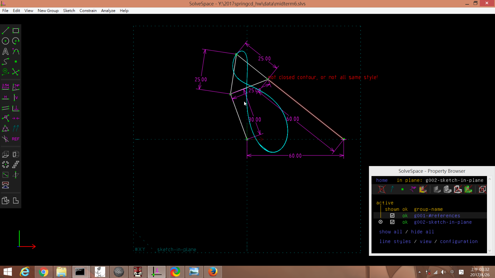

Title: 協同產品設計實習   期中測驗 
Date: 2017-04-19 12:08
Category:HW
Tags:作業
Author: 40423132

期中測驗
<!-- PELICAN_END_SUMMARY -->

#2.連桿路徑追蹤

<iframe src="https://player.vimeo.com/video/214718798" width="640" height="345" frameborder="0" webkitallowfullscreen mozallowfullscreen allowfullscreen></iframe> 
<a href="https://vimeo.com/214718798">郭力維 虎尾科大機械設計工程系40423132 - 期中-1</a> from <a href="https://vimeo.com/user47579118">郭力維</a> on <a href="https://vimeo.com">Vimeo</a>.

<!-- 導入 Brython 標準程式庫 -->

 
<!-- 啟動 Brython -->
 
 
 <!-- 以下實際利用  Brython 畫四連桿 trace point 路徑-->
 <canvas id="fourbar_40423132" width="1000" height="750"></canvas>
  

#3.行走機構繪製

<iframe src="https://player.vimeo.com/video/214837435" width="640" height="326" frameborder="0" webkitallowfullscreen mozallowfullscreen allowfullscreen></iframe> 
<a href="https://vimeo.com/214837435">虎尾科大機械設計工程系40423132 - 期中-2</a> from <a href="https://vimeo.com/user47579118">郭力維</a> on <a href="https://vimeo.com">Vimeo</a>.

<iframe src="https://player.vimeo.com/video/214836327" width="640" height="307" frameborder="0" webkitallowfullscreen mozallowfullscreen allowfullscreen></iframe> 
<a href="https://vimeo.com/214836327">虎尾科大機械設計工程系40423132 - 期中-3</a> from <a href="https://vimeo.com/user47579118">郭力維</a> on <a href="https://vimeo.com">Vimeo</a>.

#4.零件展示
===
<link href="./../work/madeleine/src/css/Madeleine.css" rel="stylesheet">

select stl file: <input type="file" id="file" /> or drop stl file

